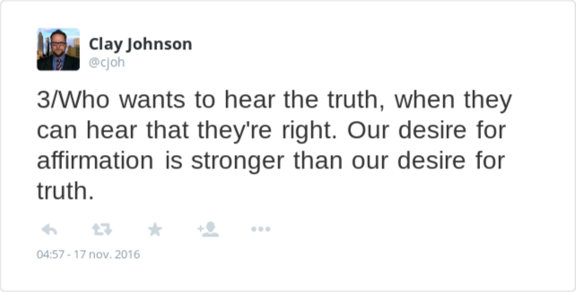
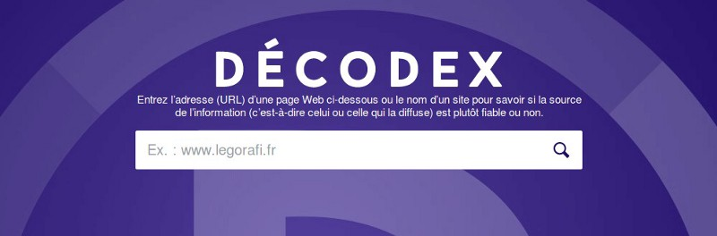
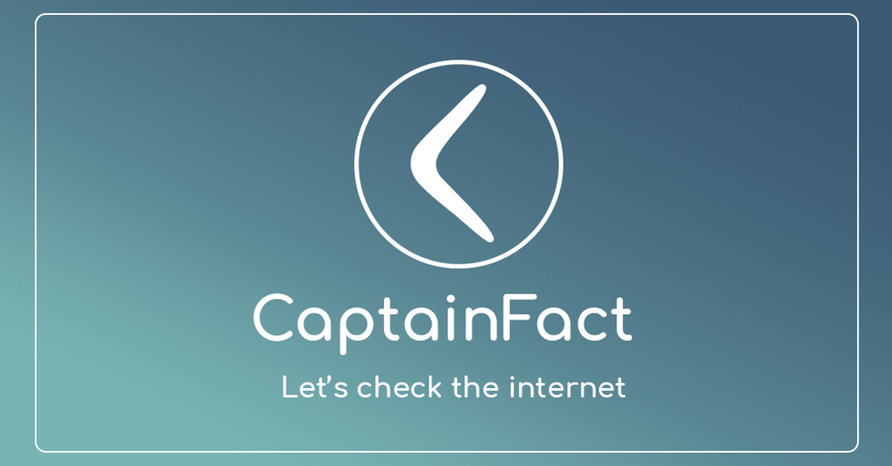

**This article was first posted on [Medium](https://medium.com/captainfact/the-urge-for-a-collaborative-citizen-fact-checking-platform-a0ce035bc608)**.
Text has been left untouched but graphical resources have been updated.

-------------------------------------------------

 

The Internet has drawn us into strange places lately. It has helped us to share information faster and at a larger scale, but it has also shown many weaknesses when it comes to verifying that information.

The biggest concern that has emerged from this is probably the disregard for facts: on the Internet, no matter what your beliefs are, you’ll find sources to confirm them. Our [confirmation bias](https://en.wikipedia.org/wiki/Confirmation_bias), with the help of Google’s and Facebook’s algorithms, has locked us into [filter bubbles](https://en.wikipedia.org/wiki/Filter_bubble) — we follow people and medias that don’t contradict too much with our view of the world and we’re often shocked when we finally debate with someone who thinks differently.

## Centralized fact-checkers

Serious medias are probably the most concerned about this misinformation issue. They see a [historic wave of distrust](http://fortune.com/2017/05/24/trust-media/) and often have trouble attracting readers: it’s easier to get people to click on your article when you’re selling them the “*ten reasons that prove aliens are among us*” than a deep and complicated analysis of a political subject.

One of the few responses we’ve seen so far from traditional medias is for them to try to act as a single source of truth. In France, the newspaper *Le Monde* has created a tool called *[Le Décodex](http://www.lemonde.fr/verification/)* to which you give a website and that tells you if you should trust it or not. But can we rely on a single, centralized media to tell us what we should read and what we should not ?

*Décodex — “Enter a web page URL or a site name to know if the source is reliable or not”*

And what will happen when less professional medias bring their own *Décodex*, when a conservative news media creates an extension warning its users that they should not read this liberally-biased media, and when liberal entities come with something to block every conservative posts from their news feed ?

**Truth, especially in politics, cannot rely only on a central authority.**

Another big issue with this approach is **granularity**. A reference media can make mistakes, and the worst fake news website can sometimes tell the truth. By telling people who they should trust or not, we’re only reinforcing the cleavage and comforting an increasing number of skeptics in their belief that traditional medias “do not want them to know the truth”.

If we want to give them some perspective, we definitely need to add some precision to this picture: verification must be **per statement** — not per media!

**We’ve also seen some interesting responses**: along with the *Décodex*, *LeMonde* also created an ambitious fact-checking platform: [Les Décodeurs](http://www.lemonde.fr/les-decodeurs/), where journalists verify specific points from articles, debates and speeches.
This initiative has many brothers and sisters: [LibéDésintox](http://www.liberation.fr/desintox,99721) for Libération (FR), [Politifact](http://www.politifact.com) (US), [FactCheck.org](http://www.factcheck.org/)…

The work done by all these services is extremely valuable: they focus on specific arguments and give sources and explanations that are usually hard to argue with. But here is the big problem : **Centralized fact-checkers will never be able to deal with the enormous amount of data produced on the Internet today**. From PolitiFact’s [own words](http://www.politifact.com/truth-o-meter/article/2017/dec/15/we-started-fact-checking-partnership-facebook-year/) :
> Let’s do an exercise: For most of 2017, there were five fact-checking organizations participating in this project in the United States. (It’s also running in France and Germany.) Let’s say they all fact-checked as many URLs as we did — 1,722, that’s 8,610 articles fact-checked a year.
> Now let’s say the universe of false news stories of 1,000 a week — that’s 52,000 articles a year.
> In that scenario, the best we’re doing is covering 16.5 percent of the field. In all likelihood, the percentage is lower.

And we’re just talking about fake news here, not misinformation in general !

**If we owe to address the issue of online misinformation, we have to let the citizen enter the arena of fact-checking.**

## Is Wikipedia’s model applicable to fact checking?

*Wikipedia — The Free Encyclopedia*

Wikipedia’s biggest strength is having been able to build a collaborative platform on which **the multiplicity and the diversity** of the contributions create a certain form of neutrality. And [most studies on the question](https://en.wikipedia.org/wiki/Reliability_of_Wikipedia) agree on the fact that for the most important subjects, Wikipedia has at least the same level of reliability than others encyclopedias; especially because it systematically **asks for sources**.

### **Could we apply the same model for our day-to-day information ?**

Well, Wikipedia is great for non-cleaving subjects. But [astroturfing](https://en.wikipedia.org/wiki/Astroturfing) proves that when it comes to sensitive and political subjects, a system that allows anyone to edit anything with very few consequences has some drawbacks; **having a sane debate requires rules**. And rules can actually be fun; could we play games without cheating otherwise?

A brilliant model to support this idea is [Stack Overflow](https://stackoverflow.blog/2009/05/18/a-theory-of-moderation/). By using reputation, votes, achievements and (reputation) bounties they have created a platform which makes people willing to contribute to what may seems like a tedious task (fixing other people’s code problems) and that naturally filters pollutive content.

## Collaborative, real-time fact checking — using games to fight misinformation

For the last year we’ve been thinking and experimenting with this idea through a project named **[CaptainFact.io](https://captainfact.io)**, a set of tools that could help us to collectively verify information **anywhere** on the Internet.

The goal: approaching Wikipedia’s reliability by using **sources, warnings and collective moderation**, with the **gamification** approach that made [Stack Overflow](https://blog.codinghorror.com/the-gamification/) a fun and safe place to be —applied to our daily news.

This is currently pursued by the development of 3 linked tools:

1. **A video overlay** (thanks to a web browser extension) that add sources and context to the videos you’re watching on the Internet. Each statement can be verified and we show with a small icon if it is believed to be true or false, based on users votes.

<iframe width="560" height="315" src="https://www.youtube.com/embed/4-_nnwgqw9c" frameborder="0" allowfullscreen></iframe>

2. **A debate platform **that aggregates this information in a place where you can have rich and focused discussions by working **point by point, argument by argument** - instead of taking the content as a whole like almost all today’s comment systems do.

<iframe width="560" height="315" src="https://www.youtube.com/embed/IJrmHU13lWY" frameborder="0" allowfullscreen></iframe>

## **Ethics, 21st century’s organizations and big brother**

If you’re concerned about privacy, you’re probably thinking right now that an extension that checks every website and video you’re watching is extremely dangerous, and you’re right. Though we respect your privacy and won’t log or sell any of this data, you shouldn’t trust us or anyone on this point.

*Ability to disable CaptainFact in one click*

What can you trust ? **Open-source** code and **open organizations**. As it is for Mozilla Firefox, we should be able to demonstrate with proof that we don’t (and won’t) track your online activity.

**[CaptainFact](https://captainfact.io) is a non-profit project** that you can back on [OpenCollective](https://opencollective.com/captainfact_io) — transparent funds, transparent code, and collective decisions on how to build it.

## What now, and how can I participate ?

The first iteration is ready: we have a debate platform and an extension that will bring these debated information down to the videos we’re watching online. I believe they are now ready to be tested on the battleground with a small number of actors to adjust the variables and see what can be improved.

Various roles and skills will be required to put this project on track:

### Content creators

If you are a Youtube creator, CaptainFact can help you to better engage your community, to bring trust on your content and to make it even richer. 
By using CaptainFact, your content is peer-reviewed by your entire community.

Beside exceptions like [WikiTribune](https://www.wikitribune.com/) very few medias can say the same.

### Beta testers

For now, CaptainFact is in private beta (invitation only). Though it is ready to scale up fast, bringing it to a very large number of people right now would be risky. We need to test and improve the existing rules, like how many negative votes a new user can make each day. Finding good values for these **can only be done through experience**.

We’re particularly interested in having **journalists** joining us, your experience with news and information verification would be very helpful to see how such tools could compare to the job that you do by yourself.

### Developers

There are many ways to improve and optimize the existing code, and many other ways for the data to be re-used. Strongly motivated developers are welcome to contribute and take a central part in this new and fast-growing project!
For those interested, current stack uses Elixir + Phoenix (server) and React (frontend + browser extension).

### Graphic designers

If you’re a graphic designer, there is cool stuff to work on for CaptainFact. We especially need fun graphics for [achievements](https://captainfact.io/help/achievements).

### Lawyers

We’re in favor of a [strong free-speech policy](https://captainfact.io/help/censorship_requests). Law geek’s passionate about these questions could help us achieving our goals without conflicting with international laws.

### Translators

At the moment the website is available in English and French. We’d love to have it available in Spanish, German and any other language that could help to bring these tools to a wider community.

### Enthusiasts

This is a collaborative project and we need people to spread the word. Community managers, students interested in media literacy… [contact us](mailto:contact@captainfact.io) if you’re motivated about working together!

### Share the love ❤️

You can follow the project on [Twitter](https://twitter.com/CaptainFact_io) and on [Facebook](https://www.facebook.com/CaptainFact.io)
